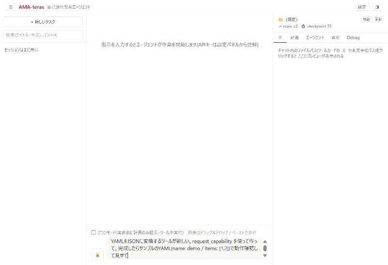

# AMA-teras

**Ask for a feature, and the app builds it itself — without ever going rogue.**

日本語版はこちら → [README.md](README.md)

A self-evolving desktop AI agent (Electron + React + TypeScript). It plans → implements →
debugs → tests through conversation, and when it lacks a capability, it **writes a new tool
for itself — which only ships after passing verification gates and your explicit approval**.

## Demo



📝 Behind the scenes (Japanese article): [Fable 5にアプリを自分自身ごと進化させたら、6夜でOSS公開まで走れた](https://zenn.dev/moriwo_dev_ai/articles/ama-teras-self-evolving-agent)

## Features

### 🛡 Safe self-evolution

No code runs unreviewed — neither its own nor anyone else's. Every evolution passes the same gates:

```
request → generated in an isolated worktree (B environment)
        → 3-stage verification (typecheck → tests → smoke run)
        → user approval → promotion (git tag) → automatic rollback on failure
```

- The running app (A) is never touched; generation and verification happen in an isolated copy (B)
- **Protected areas** (the approval mechanism, the evolution engine itself, key storage, …)
  are machine-enforced off-limits — for evolution jobs *and* for the normal chat path
- Generated tools that use `child_process` or network access trigger explicit warnings
  in the approval dialog

### 🎛 6-band model orchestration

Assign the right model to each role, and spend your top-tier model only where it matters.

| Band | Role |
|---|---|
| planner | planning & final responses (top model) |
| worker | implementation legwork (mid-tier) |
| explorer | investigation & read-only research (lightweight) |
| reviewer | quality review (auditor) |
| midEscalation / escalation | staged upgrades when stuck |

A quality review gate (severity-based) scores every milestone and automatically sends
work back when high-severity findings remain.

### 🆓 Free API mode

Try it without a credit card. From Settings → "Start for free", connect a free-tier API key
from Google Gemini / Groq / OpenRouter in three steps (via OpenAI-compatible endpoints).
Free mode automatically dials down cost-heavy features.

## Installation

### For developers (from source)

```bash
git clone https://github.com/moriwo-dev-ai/ama-teras.git
cd ama-teras
npm install
npm run build      # first build (app + mobile UI)
npm start          # launch
npm run dev        # development (HMR)
npm run typecheck  # tsc (node / web / remote-ui)
npm test           # vitest
```

Register your API key in the in-app Settings (stored via OS encryption; never in plain text).

### For everyone else

A Windows installer is in preparation.

See [docs/USER-GUIDE.md](docs/USER-GUIDE.md) for usage (Japanese), and
[docs/REMOTE-SECURITY.md](docs/REMOTE-SECURITY.md) for the security model of remote
(phone) access via Tailscale.

## Architecture overview

```mermaid
flowchart LR
  subgraph Renderer["renderer (React UI)"]
    UI[chat / diff / approvals / evolution panel]
  end
  subgraph Main["main process"]
    Loop[agent loop]
    Tools[tool plugins<br>read/write/edit/grep/bash…]
    Prov[provider layer<br>Anthropic / OpenAI / OpenAI-compatible]
    Evo[evolution manager]
  end
  subgraph B["B environment (git worktree)"]
    Job[evolution job(child agent)]
    Gate[verification gates<br>typecheck→test→smoke]
  end
  UI <-->|typed IPC| Loop
  Loop --> Tools
  Loop --> Prov
  Tools -->|request_capability| Evo
  Evo --> Job --> Gate -->|promoted with user approval| Tools
```

- **main**: agent loop, tool execution, API clients, evolution manager
- **renderer**: chat, diff view, approval dialogs, evolution job status
- **tools = plugins**: one tool per module (`ToolPlugin` interface), loaded dynamically
- Design details in `ARCHITECTURE.md` and `docs/`; progress and decisions in `PROGRESS.md`

## License & contributing

- Licensed under **AGPL-3.0** ([LICENSE](LICENSE)) — modified versions offered as a network
  service must also publish their source.
- The name "AMA-teras" may not be used by forks (trademark policy: [NOTICE.md](NOTICE.md)).
- **Contributions welcome** — see [CONTRIBUTING.md](CONTRIBUTING.md) (DCO, protected-area
  policy, severity-based review). Plugin sharing / registry design: `REGISTRY_DESIGN.md`.
