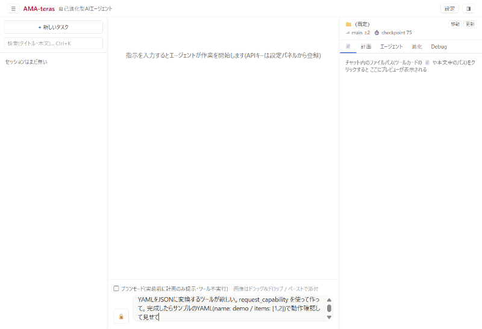
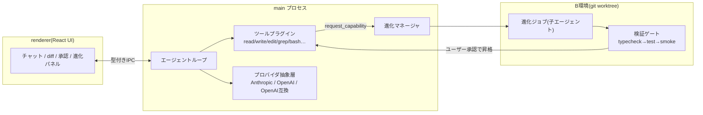

# AMA-teras

**欲しい機能を言うと、アプリが自分で作る。ただし暴走はしない。**

English version → [README.en.md](README.en.md)

自己進化型デスクトップAIエージェント(Electron + React + TypeScript)。
対話しながら 計画 → 実装 → デバッグ → テスト をほぼ自動で進め、足りない機能に出会うと
**自分で新しいツールを生成し、検証ゲートとあなたの承認を通ってから**自分に組み込みます。

## なぜ作ったか — 企業に囚われないAIエージェント

AIエージェントの能力が、特定ベンダーの課金プランと同義になりつつあります。
AMA-terasは逆を向きます。

- **モデルは選べる部品**: Anthropic / OpenAI / Moonshot(Kimi)を設定で切替。無料枠API(Gemini/Groq/OpenRouter)でも動く。どこにもロックインしない
- **育つのはあなたの機体**: エージェントが書いたツールはあなたのPCに残るあなたの資産。エクスポートも共有も自由(AGPL)
- **無審査では1行も入らない**: スキルマーケットの監査で12〜20%が悪性と報告される時代に、自分の生成物にも他人の共有物にも同じ検証ゲート(隔離worktree→型検査→テスト→スモーク→**あなたの承認**)を課します

## デモ



UIは日本語/英語を切替できます(Settings → UI language)。
The UI is available in English — screenshots: [chat](docs/screenshots/chat-en.png) / [evolution panel](docs/screenshots/evolution-en.png).

📝 開発の裏側: [Fable 5にアプリを自分自身ごと進化させたら、6夜でOSS公開まで走れた](https://zenn.dev/moriwo_dev_ai/articles/ama-teras-self-evolving-agent)

## 正直な現在地

小さな初期段階のOSSです。できること・まだ弱いことを隠さず書きます:

- **今できる**: 自己進化の一巡(生成→隔離worktree→型検査/テスト/スモーク→承認→タグ付き昇格・ロールバック)、モデル切替(ローカルのOpenAI互換エンドポイント含む)、SKILL.mdの読み書き、スマホからの承認
- **APIキーは持ち込み**: 推論は同梱しません。無料枠APIでも動きますが、生成品質は持ち込むモデルに依存します
- **実機検証済みはWindowsのみ** — mac/linuxビルドはCIにありますが実験的で、実機未検証です
- **ドキュメントは日本語中心**(英語READMEとアプリ内英語UIが現状の例外)

## 特徴

### 🛡 安全な自己進化

自分のコードも、他人のコードも、無審査では動きません。すべての進化が同じゲートを通ります。

```
要求 → B環境(git worktree)で生成 → 検証3段(typecheck → テスト → スモーク)
     → ユーザー承認 → 昇格(gitタグ) → 失敗時は自動ロールバック
```

- 稼働中のアプリ(A)には触れず、隔離された作業コピー(B)で生成・検証
- 承認機構・進化エンジン自体などの**保護領域**は進化ジョブから変更不可
- `child_process` やネットワークを使う生成ツールは承認ダイアログで明示警告

### 🎛 6帯モデルオーケストレーション

役割ごとに最適なモデルを割り当てて、最上位モデルを「ここぞ」だけに使います。

| 帯 | 役割 |
|---|---|
| planner | 計画・最終応答(最上位モデル) |
| worker | 実装の手数(中位) |
| explorer | 調査・読み取り(軽量) |
| reviewer | 品質レビュー(監査役) |
| midEscalation / escalation | 詰まったときの段階的格上げ |

品質レビュー・ゲート(severity方式)が各マイルストーンを採点し、
重大指摘が残る成果物は自動で差し戻されます。

### 📚 SKILL.md互換(オープン標準・双方向)

Claude Code / Codex / Cursor など30以上のエージェントが採用する **SKILL.md** 標準に、
消費側・供給側の両方で対応しています。

- **使う**: `skill_list` / `skill_use` ツールで、同梱20本+`userData/skills/` に置いた
  任意のSKILL.mdフォルダを実行時に読み込み(必要な瞬間だけ本文をロード)。
  コミュニティの既存スキル資産がそのまま使えます
- **同梱20本**: TDD規律・フロントエンド設計・セキュリティレビュー・Playwright E2E・
  pdf/docx/xlsx/pptx処理 など、エコシステムの定番能力をオリジナル執筆で収録
- **作る**: 検証ゲートを通った自作ツールは `SKILL.md + run.mjs + 検証証跡` として
  エクスポートでき、他のエージェントでもそのまま動きます(ツール工場としてのAMA-teras)

### 🆓 無料APIモード

カード登録なしで今すぐ試せます。設定の「無料で始める」から
Google Gemini / Groq / OpenRouter の無料枠APIキーを3ステップで接続
(OpenAI互換エンドポイント経由)。無料モードでは消費の激しい機能を自動で軽量化します。

## インストール

### 開発者向け(ソースから)

```bash
git clone https://github.com/moriwo-dev-ai/ama-teras.git
cd ama-teras
npm install
npm run build      # 初回ビルド(本体 + スマホUI)
npm start          # 起動
npm run dev        # 開発起動(HMR)
npm run typecheck  # tsc(node / web / remote-ui)
npm test           # vitest
```

APIキーはアプリ内の「設定」から登録します(OS暗号化ストレージ保存。平文保存なし)。

### 一般向け

**[📥 最新版インストーラをダウンロード](https://github.com/moriwo-dev-ai/ama-teras/releases/latest)**(Windows・約102MB・管理者権限不要)

リンク先の Assets から `AMA-teras Setup <版>.exe` を取得してください。
**更新も同じ手順**です(新しい版が出るとアプリ上部にお知らせが出ます。上書きインストールで、
設定・APIキー・会話履歴はそのまま引き継がれます)。過去の版は [Releases](https://github.com/moriwo-dev-ai/ama-teras/releases) から。

> **注意(SmartScreen警告について)**: 配布予定のインストーラはコード署名なしのため、
> 初回実行時に Windows SmartScreen の警告(「WindowsによってPCが保護されました」)が
> 表示されます。**「詳細情報」→「実行」**の順にクリックすると起動できます。
> 署名証明書は個人開発では高額なため未導入です。不安な場合はソースからのビルドを
> ご利用ください(上記「開発者向け」)。

使い方の詳細は [docs/USER-GUIDE.md](docs/USER-GUIDE.md)、スマホからのリモート操作
(Tailscale経由)のセキュリティ前提は [docs/REMOTE-SECURITY.md](docs/REMOTE-SECURITY.md)
を参照してください。

## アーキテクチャ概要



- **main**: エージェントループ・ツール実行・APIクライアント・進化マネージャ
- **renderer**: チャット、diffビュー、承認ダイアログ、進化ジョブの状態表示
- **ツール = プラグイン**: 1ツール=1モジュール(`ToolPlugin` インターフェース)。起動時+実行中に動的ロード
- 設計の詳細は `ARCHITECTURE.md` と `docs/`、開発の進捗・判断記録は `PROGRESS.md`

## ライセンスとコントリビューション

- 本体は **AGPL-3.0**([LICENSE](LICENSE))。改変版をネットワークサービスとして提供する場合も
  ソース公開義務が生じます。
- 「AMA-teras」の名称はフォークでは使用できません(商標方針は [NOTICE.md](NOTICE.md))。
- **コントリビューション歓迎**: 進め方・DCO・聖域(保護領域)の方針・レビュー基準は
  [CONTRIBUTING.md](CONTRIBUTING.md) を参照してください。
  プラグイン共有・レジストリ構想は `REGISTRY_DESIGN.md` を参照してください。
